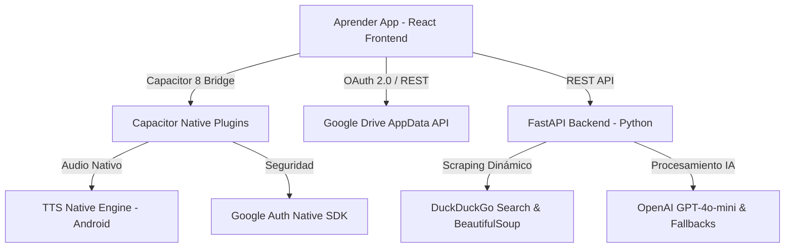

# 🎓 Aprender App — Simulador de Tests & Temarios Premium para Oposiciones

**Aprender App** es una plataforma educativa de alto rendimiento diseñada para la preparación avanzada de oposiciones y exámenes técnicos. Disponible tanto en versión **Web** como **Mobile (Android Nativo)** a través de una integración híbrida con **Capacitor 8**.

> 🔒 **Nota sobre el código fuente:** Este es un repositorio público de presentación (*Showcase*). El código fuente original, los scripts de extracción y las bases de datos de preguntas se encuentran en un **repositorio privado** para proteger los derechos de propiedad intelectual y los activos comerciales del proyecto. Si eres un reclutador y deseas realizar una revisión técnica de la arquitectura de código, por favor contáctame para programar una demo técnica por pantalla compartida.

---

## 📱 Demostración Visual & Características Premium

### 1. 🎙️ Modo Podcast & Audio IA (TTS Secuencial)
*   **Funcionalidad:** Un sistema automatizado de manos libres que lee secuencialmente cada pregunta y su respuesta correcta en orden, permitiendo al opositor estudiar mientras realiza otras tareas (caminar, cocinar, viajar).
*   **Ingeniería:** Desarrollado utilizando el plugin nativo `@capacitor-community/text-to-speech` para garantizar el funcionamiento en segundo plano (incluso con la pantalla bloqueada).
*   **Ajustes de Voz:** Configurado con una velocidad optimizada de **x1.3 / x1.5** y modulación de frecuencia (*pitch*) a 1.0 para ofrecer una voz masculina ("Álvaro IA") cristalina, fluida y sin distorsión.

### 2. 📖 Modo Estudio (Ver Todas)
*   **Funcionalidad:** Permite alternar instantáneamente la interfaz del simulador a un modo de "lectura rápida" en el que todas las preguntas del examen aparecen resueltas y con la opción correcta resaltada en tiempo real.
*   **Responsividad:** Diseño responsivo blindado contra desbordamientos (*overflows*) laterales y adaptabilidad de zoom inteligente tanto en orientación vertical como horizontal.

### 3. 🎯 Corrección Dinámica por Tramos (1/3 y 2/3)
*   **Funcionalidad:** En lugar de esperar al final del examen (que puede constar de más de 100 preguntas), el opositor puede validar su progreso en puntos de control estratégicos (al completar un tercio o dos tercios del test).
*   **Persistencia:** Los fallos cometidos en cada tramo se guardan inmediatamente en un historial persistente de `LocalStorage` para poder reintentar únicamente los errores más adelante.

### 4. ☁️ Sincronización en la Nube con Google Drive (Base de Datos a Coste Cero)
*   **Funcionalidad:** Copia de seguridad automática de todo el progreso del usuario, estadísticas, y tests fallidos en la nube de Google Drive.
*   **Seguridad:** Implementación de Google OAuth 2.0 y Capacitor Google Auth nativo. Los datos del usuario se almacenan de forma segura y privada dentro del directorio aislado `appDataFolder` de la cuenta de Drive del propio usuario, garantizando privacidad absoluta y un coste de infraestructura de servidor de 0€ para el creador de la app.

---

## 🛠️ Arquitectura Técnica & Stack Tecnológico

El proyecto está estructurado con una arquitectura modular y limpia, diseñada para ser mantenible y escalable:

### 💻 Frontend (React + Híbrido)
*   **React 19 & React Router 7:** SPA rápida con navegación virtual optimizada para dispositivos móviles.
*   **Vite 8 & Rolldown:** Compilador ultra rápido y optimización de chunks para un empaquetado de producción óptimo de cara al APK final.
*   **Vanilla CSS Premium:** Sistema de diseño responsivo basado en variables dinámicas, animaciones fluidas (`@keyframes`) y soporte nativo para visualización horizontal en dispositivos móviles.

### 🔌 Integración Nativa (Capacitor 8)
*   **Text-to-Speech Nativo:** Bypassea las restricciones de ahorro de datos de los navegadores móviles mediante el motor nativo de TTS de Android.
*   **Google Auth:** Inicio de sesión único nativo mediante credenciales seguras del sistema operativo.

### 🐍 Backend & Inteligencia Artificial (FastAPI + Python)
*   **Generador Inteligente de Temarios:** Un sistema que realiza búsquedas web automáticas y scraping de PDFs técnicos reales de internet mediante `BeautifulSoup` y la API de DuckDuckGo.
*   **Procesamiento de Lenguaje Natural (NLP):** Los textos scrapeados son estructurados en temarios interactivos de 5 niveles de dificultad utilizando modelos avanzados de IA en formato JSON estricto.

---

## 📈 Metodologías de Desarrollo Aplicadas

1.  **Optimización del Rendimiento Móvil:** Compilación a producción optimizada con minificación agresiva. Carga bajo demanda de módulos para asegurar un tiempo de respuesta de pantalla inmediato en cualquier terminal Android.
2.  **Seguridad de Credenciales:** Gestión estricta de variables de entorno mediante `.env` (excluidos de Git de forma nativa), impidiendo la exposición de APIs y Client IDs de Google.
3.  **Clean Code & SOLID:** Separación limpia de responsabilidades (Servicios para llamadas API, Hooks personalizados para lógica de estado persistente, y Componentes puros para interfaz de usuario).

---

## 📬 Contacto & Enlaces de Interés

Si te interesa conocer más sobre este proyecto, ver el código fuente privado en una sesión guiada o discutir oportunidades de colaboración:

*   **GitHub:** [@alvaro-fullstack](https://github.com/alvaro-fullstack)
*   **LinkedIn:** [Alvaro Fullstack](https://www.linkedin.com/) *(Introduce aquí tu enlace)*
*   **Live Web Demo:** *Próximamente disponible*
