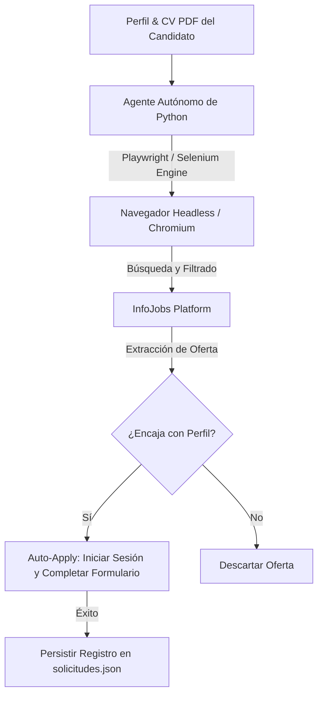

# 🤖 Agente Autónomo de Búsqueda de Empleo — Auto-Apply para InfoJobs

**Agente Autónomo de Búsqueda de Empleo** es una solución de ingeniería de automatización RPA (Robotic Process Automation) diseñada para realizar búsquedas activas de empleo, análisis de perfil y postulación automática en plataformas como InfoJobs sin intervención humana.

> 🔒 **Nota sobre el código fuente:** Este es un repositorio público de presentación (*Showcase*). Las credenciales de acceso, cookies de sesión, datos personales del CV y scripts con selectores privados se omiten en este repositorio por seguridad. Para una demostración en vivo de la automatización en ejecución, contáctame para una demo por pantalla compartida.

---

## 💡 ¿Qué problema resuelve?

Buscar trabajo manualmente requiere horas diarias de tareas repetitivas: buscar ofertas, filtrar por zona/tecnología, abrir formularios de solicitud, adjuntar currículums y responder preguntas habituales de los reclutadores.

Este bot inteligente **automatiza el 100% del proceso**:
* Lee el perfil del candidato desde su CV en formato PDF.
* Rastrea InfoJobs por palabras clave, categorías técnicas y ubicaciones geográficas.
* Analiza las ofertas y realiza el proceso completo de inscripción (*Auto-Apply*).
* Guarda un registro estructurado para evitar duplicados.

---

## 🎯 Características Principales

### 1. 🔍 Navegación y Extracción Automatizada
* **Búsqueda Avanzada:** Rastreos por palabras clave (*React, Python, Full Stack, DevOps*), filtrando por modalidad (Remoto, Híbrido, Presencial) y ubicaciones.
* **Manejo de DOM Dinámico:** Estrategias avanzadas de selectores CSS y XPath que se adaptan a cambios menores en la interfaz de InfoJobs.

### 2. ⚡ Proceso de Inscripción Inteligente (Auto-Apply)
* **Gestión de Formularios:** Automatización del flujo de postulación, interactuando con botones de confirmación, menús desplegables y campos de texto.
* **Bypass de Bloqueos & Cookies:** Inyección de cookies de sesión autenticadas previamente y gestión de diálogos de consentimiento GDPR.

### 3. 📊 Control de Estado y Persistencia
* **Prevención de Duplicados:** Almacena los identificadores de ofertas procesadas en un archivo de estado local (`solicitudes.json`).
* **Logs en Tiempo Real:** Registro detallado de ofertas inspeccionadas, inscripciones completadas y errores de formulario.

---

## 🛠️ Arquitectura Técnica

### 💻 Stack Tecnológico
* **Python 3.10+:** Lenguaje base para el control asíncrono y procesamiento.
* **Playwright & Selenium:** Automatización y renderizado completo del navegador para interactuar con aplicaciones de página única (SPA).
* **PyPDF2 / pdfplumber:** Análisis y extracción de texto de currículums en formato PDF.
* **JSON State Management:** Almacenamiento ligero de candidaturas y estados.
