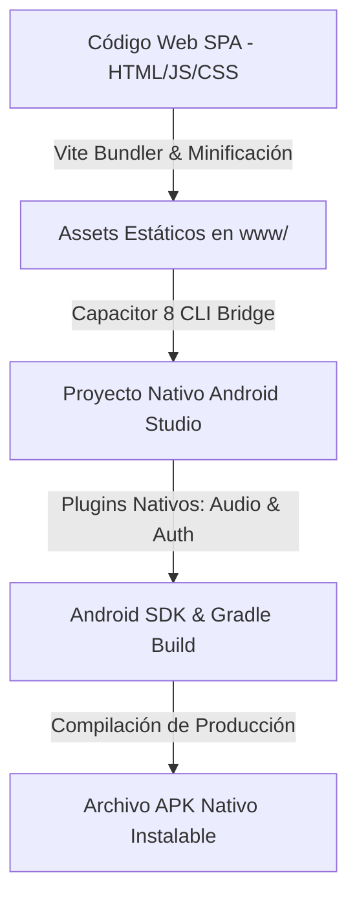

# 📱 Convertidor HTML a APK — Suite Nativa de Test Oposiciones TIC (Android)

**Convertidor HTML a APK** es un proyecto de desarrollo híbrido móvil que transforma plataformas de test web de oposiciones TIC en una aplicación nativa de Android fluida, rápida y con funcionamiento 100% offline.

> 🔒 **Nota sobre el código fuente:** Repositorio de presentación (*Showcase*). El paquete APK firmado y los datasets JSON de exámenes oficiales se alojan en un repositorio privado. Contacta con el desarrollador para una demostración en vivo.

---

## 🎯 Características Principales

1. **Base de Datos Masiva de Exámenes (+100 Test):** Banco de preguntas estructuradas en JSON de convocatorias oficiales de oposiciones TIC.
2. **Funcionamiento 100% Offline (Offline First):** Toda la lógica y datos de test están empaquetados dentro del APK para realizar simulacros sin consumo de datos ni necesidad de Wi-Fi.
3. **Integración con Voz Nativa (Text-To-Speech):** Utiliza el motor TTS nativo del dispositivo Android para leer preguntas y opciones.
4. **Google Auth Nativo:** Autenticación fluida con credenciales del sistema operativo Android.

---

## 🛠️ Arquitectura Híbrida & Proceso de Compilación

### 💻 Stack Tecnológico
* **Núcleo Nativo:** **Capacitor 8 Core & Android SDK**.
* **Frontend Web:** **JavaScript (ES6+)**, **HTML5**, **CSS3**, **Vite**.
* **Plugins Nativos:** `@capacitor-community/text-to-speech` y `@codetrix-studio/capacitor-google-auth`.
* **Entorno de Compilación:** **Android Studio**, **Gradle**, **Java/Kotlin**.
