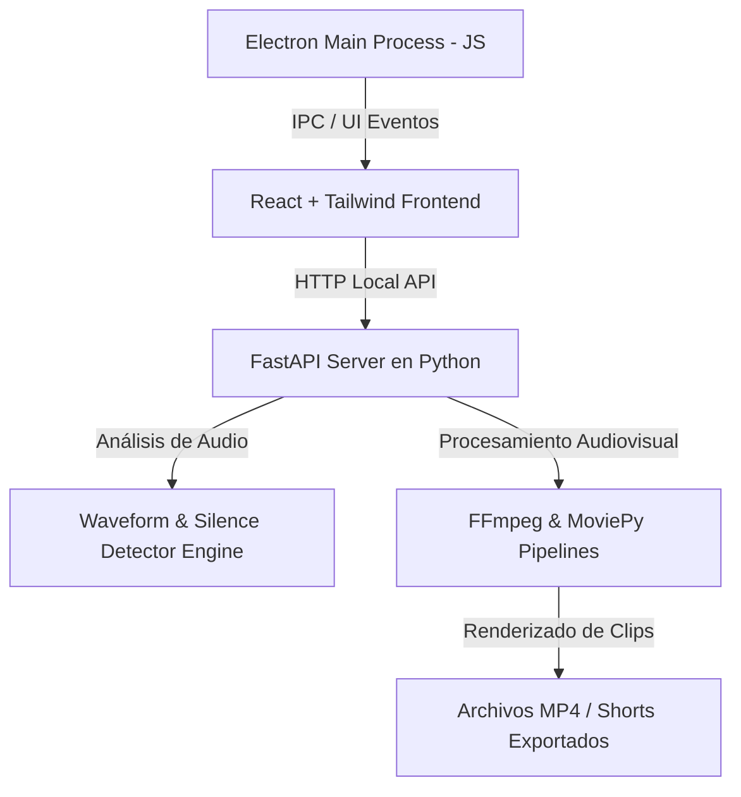

# 🎬 Edit-Video — Editor Inteligente de Vídeo & Generador Automático de Shorts

**Edit-Video** es una suite de edición de vídeo de escritorio multiplataforma diseñada para automatizar la producción de contenidos audiovisuales. Procesa la señal de audio en tiempo real para recortar silencios, eliminar muletillas y generar automáticamente vídeos en formato vertical (Shorts / Reels / TikToks) basados en puntos clave.

> 🔒 **Nota sobre el código fuente:** Este es un repositorio público de presentación (*Showcase*). El motor interno en Python y las binarias compiladas de FFmpeg se mantienen en un repositorio privado. Contacta con el autor para realizar una demostración técnica por pantalla compartida.

---

## 🎯 Características Destacadas

### 1. ✂️ Eliminador Algorítmico de Silencios
* **Funcionamiento:** Analiza la envolvente de la onda de sonido (*waveform envelope*) ajustando umbrales de amplitud en decibelios (dB) para detectar pausas de voz y recortarlas milimétricamente sin cortar palabras.

### 2. 🗣️ Filtro de Muletillas y Pausas de Voz
* **Funcionamiento:** Identifica patrones de sonido repetitivos (como *"ehh"*, *"mmm"*) mediante reconocimiento de voz y análisis espectral, listándolos en una interfaz interactiva para borrarlos con un solo clic.

### 3. 📱 Generador de Shorts Automático (Highlights Detector)
* **Funcionamiento:** Detecta los momentos con mayor densidad de voz o impacto y recorta clips independientes adaptando la relación de aspecto de 16:9 a **9:16 (formato vertical)** para redes sociales.

### 4. 🎛️ Línea de Tiempo Interactiva & Previsualización
* **Funcionamiento:** Visualizador gráfico de la forma de onda (*waveform viewer*) con controles de ajuste de volumen, selección de fragmentos y renderizado previo sin congelar la aplicación.

---

## 🛠️ Arquitectura Técnica Híbrida (Electron + Python)

### 💻 Stack Tecnológico
* **Frontend de Escritorio:** **Electron** + **React 18** + **Tailwind CSS** (interfaz de usuario fluida y reactiva).
* **Backend de Procesamiento:** **FastAPI (Python)** ejecutado como proceso secundario en segundo plano.
* **Motor Multimedia:** **FFmpeg** y **MoviePy** para manipulaciones pesadas de vídeo, remuxing y renderizado acelerado.
