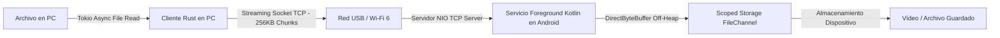

# ⚡ High-Speed Android Transfer — Transferencia Ultrarrápida PC a Móvil (Rust + Kotlin)

[](https://www.rust-lang.org/)
[](https://kotlinlang.org/)
[](https://tokio.rs/)
[]()

**High-Speed Android Transfer** es un sistema de ingeniería de sistemas diseñado para sustituir por completo el lento e inestable protocolo MTP de Windows al transferir archivos hacia dispositivos Android. Logra velocidades máximas a través de un flujo TCP directo tanto por cable USB 3.1 (mediante redirección de puertos ADB) como por redes Wi-Fi 6 (5GHz/6GHz).

> 🔒 **Nota sobre el código fuente:** Repositorio de presentación (*Showcase*). Las implementaciones nativas completas y binarios de prueba se reservan en un repositorio privado. Contáctame para solicitar una demostración técnica con envío de archivos de gran tamaño en tiempo real.

---

## ⚡ ¿Por qué reemplazar MTP?

El protocolo nativo MTP (*Media Transfer Protocol*) de Windows sufre graves deficiencias:
* Se congela con frecuencia durante transferencias de archivos grandes (como vídeos 4K).
* Genera alta sobrecarga de procesamiento de archivos en el explorador de Windows.
* No aprovecha todo el ancho de banda disponible en conexiones USB 3.1 o Wi-Fi 6.

Este proyecto resuelve estos problemas utilizando un **streaming binario asíncrono TCP directo** con framing personalizado.

---

## 🎯 Características Principales

1. **Bypass del Protocolo MTP:** Comunicación socket TCP pura sin intermediarios del sistema de archivos de Windows.
2. **Transferencia Híbrida:**
   * **Modo Cable (USB 3.1):** Redirección de puertos local mediante ADB (`adb forward tcp:8080 tcp:8080`).
   * **Modo Inalámbrico:** Conexión TCP directa sobre redes Wi-Fi 6 de alta velocidad.
3. **Gestión Zero-Allocation de Memoria:** Uso de buffers alineados dinámicamente de **256 KB** optimizados para las cachés L2/L3 de procesadores móviles (Snapdragon).

---

## 🛠️ Arquitectura Técnica de Bajo Nivel

```
[Cliente PC en Rust] ──(256 KB Direct Buffers)──> [Socket TCP] ──> [Android Foreground Service] ──> [Scoped Storage FileChannel]
```



### 💻 Stack de Ingeniería
* **Cliente de PC (Emisor):** **Rust 2021** con **Tokio** para entrada/salida asíncrona no bloqueante y baja huella de memoria.
* **App Móvil (Receptor):** **Kotlin** con **Coroutines** asíncronas ejecutadas dentro de un *Foreground Service* persistente en Android.
* **Manejo de Almacenamiento:** Integración directa con **Android Scoped Storage** utilizando `FileChannel` y `DirectByteBuffer` (*off-heap memory*) para evitar pausas del Garbage Collector.
