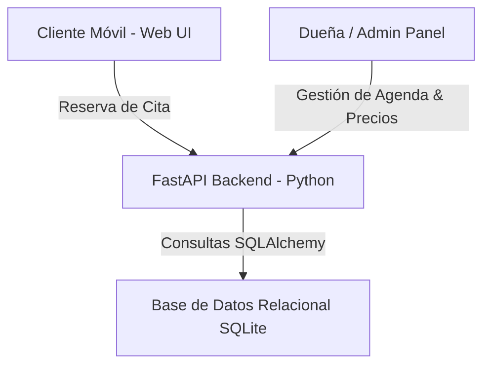

# 💅 App de Reservas Comercial — Plataforma Web de Citas & Panel Admin

**App de Reservas de Manicura** es una solución de software comercial orientada a pequeños negocios de estética y belleza. Ofrece un flujo doble de reserva pública para clientes desde dispositivos móviles y un panel de administración privado para la gestión de agenda del establecimiento.

> 🔒 **Nota sobre el código fuente:** Repositorio de presentación (*Showcase*). La versión comercial desplegada y configuraciones de producción se mantienen en privado. Solicita una demo técnica para ver la app en ejecución.

---

## 🎯 Características Principales

### 1. 📱 Portal de Reservas para Clientes (Mobile-First)
* **Selección de Tratamientos:** Catálogo de servicios con duraciones y precios dinámicos.
* **Reserva de Horarios:** Selección de fecha y franja horaria disponible en tiempo real.
* **Confirmación de Cita:** Formulario sencillo sin fricción de registro largo.

### 2. 🔐 Panel de Control de Administración (Privado)
* **Gestión de Agenda:** Visualización diaria y semanal de las citas programadas.
* **CRUD de Tratamientos:** Alta, baja y modificación de precios, duraciones y descripciones de servicios.
* **Cancelación & Notificación:** Control total de horarios bloqueados y citas activas.

---

## 🛠️ Arquitectura de Software

### 💻 Stack Tecnológico
* **Backend:** **FastAPI** (Python 3.8+) con **Uvicorn**.
* **Base de Datos:** **SQLite** con **SQLAlchemy ORM**.
* **Frontend:** **HTML5, CSS3, JavaScript Vanilla** optimizado para carga ultra rápida en teléfonos móviles.
