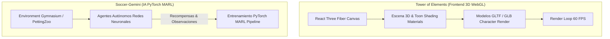

# 🎮 Tower of Elements & JuegosRaiz — Videojuegos 3D Web & IA Multi-Agente (MARL)

**Tower of Elements & JuegosRaiz** es un proyecto enfocado en la exploración gráfica 3D en la web mediante WebGL e Inteligencia Artificial basada en Aprendizaje por Refuerzo Multi-Agente (MARL).

> 🔒 **Nota sobre el código fuente:** Repositorio de presentación (*Showcase*). Los assets 3D optimizados, modelos entrenados de redes neuronales `.pt` y repositorios de motores se mantienen en privado. Solicita una demo técnica por pantalla compartida.

---

## 🎯 Proyectos Incluidos

### 1. ⚔️ Tower of Elements (Juego 3D WebGL)
* **Visuales Toon Shading:** Renderizado estilizado de personajes anime y escenarios mediante shaders personalizados (`BaseToonMaterial`).
* **Control & Físicas:** Movimiento de personajes 3D, combate, sistema de cámara y animaciones jerárquicas ejecutadas a 60 FPS estables en el navegador.
* **Stack:** `React 18`, `TypeScript`, `@react-three/fiber`, `@react-three/drei`, `Three.js`, `Vite`.

### 2. ⚽ Soccer-Gemini (Aprendizaje por Refuerzo Multi-Agente - MARL)
* **Entorno de Simulación:** Simulación deportiva en Python donde múltiples agentes compiten y colaboran en tiempo real.
* **Algoritmos de IA:** Redes neuronales profundas entrenadas con PyTorch e interfaces de aprendizaje de entornos tipo Gymnasium / PettingZoo.

---

## 🛠️ Arquitectura Gráfica & Flujo de Simulación

